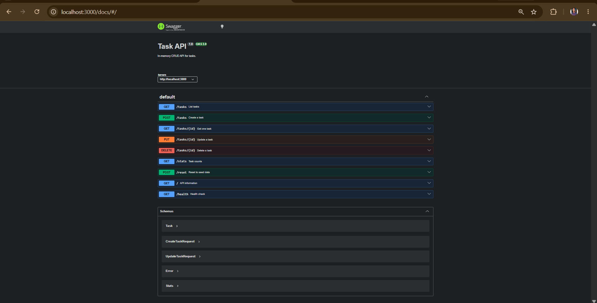
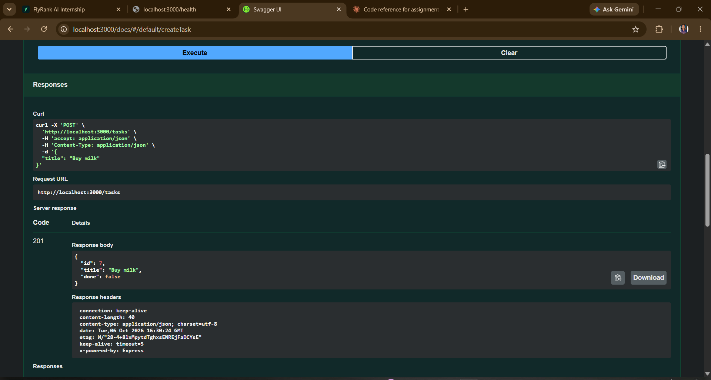

# Task API — FlyRank Internship Week 2 Assignment A1

A small **Node.js + Express CRUD API** for managing a to-do list. The API supports Create, Read, Update, and Delete operations using an in-memory task list, and provides interactive Swagger UI documentation.

This project follows the Week 2 assignment requirements: HTTP methods, CRUD, status codes, Swagger UI, curl testing, and Git/GitHub publishing.

## Tech stack

- Node.js
- Express
- Swagger UI (`swagger-ui-express`)
- OpenAPI 3.0.3
- In-memory JavaScript array (no database)

## Getting started

### 1. Install dependencies

```bash
npm install
```

### 2. Start the API

```bash
npm start
```

For development with automatic restart:

```bash
npm run dev
```

The API runs at:

```text
http://localhost:3000
```

Swagger UI:

```text
http://localhost:3000/docs
```

## Seed data

The server starts with three tasks:

```json
[
  { "id": 1, "title": "Buy groceries", "done": false },
  { "id": 2, "title": "Walk the dog", "done": true },
  { "id": 3, "title": "Read a book", "done": false }
]
```

Data is intentionally stored only in memory. Restarting the server resets the data to the three seed tasks. This is expected for this assignment; a database is introduced in the following week.

## API endpoints

| Method | Endpoint | Purpose | Success | Errors |
|---|---|---|---|---|
| GET | `/` | API information | 200 | — |
| GET | `/health` | Health check | 200 | — |
| GET | `/tasks` | List all tasks | 200 | 400 |
| GET | `/tasks/:id` | Get one task | 200 | 404 |
| POST | `/tasks` | Create a task | 201 | 400 |
| PUT | `/tasks/:id` | Update a task | 200 | 400, 404 |
| DELETE | `/tasks/:id` | Delete a task | 204 | 404 |
| GET | `/stats` | Task statistics (extra) | 200 | — |
| POST | `/reset` | Restore seed data (extra) | 200 | — |
| GET | `/docs` | Swagger UI | 200 | — |

## CRUD examples

### Read all tasks

```bash
curl -i http://localhost:3000/tasks
```

### Read one task

```bash
curl -i http://localhost:3000/tasks/1
```

Unknown IDs return `404`:

```bash
curl -i http://localhost:3000/tasks/99
```

Response body:

```json
{"error":"Task 99 not found"}
```

### Create a task

```bash
curl -i -X POST http://localhost:3000/tasks \
  -H "Content-Type: application/json" \
  -d '{"title":"Buy milk"}'
```

The server assigns the next available ID, sets `done` to `false`, and returns `201 Created`.

Invalid input such as `{}` returns `400 Bad Request`.

### Update a task

Update the completion state:

```bash
curl -i -X PUT http://localhost:3000/tasks/1 \
  -H "Content-Type: application/json" \
  -d '{"done":true}'
```

Update both fields:

```bash
curl -i -X PUT http://localhost:3000/tasks/1 \
  -H "Content-Type: application/json" \
  -d '{"title":"Buy oat milk","done":true}'
```

### Delete a task

```bash
curl -i -X DELETE http://localhost:3000/tasks/1
```

A successful delete returns `204 No Content` with an empty body.

## Sample `curl -i` output

```text
$ curl -i http://localhost:3000/tasks/1
HTTP/1.1 200 OK
X-Powered-By: Express
Content-Type: application/json; charset=utf-8
Content-Length: 45
ETag: W/"2d-Gv8HDdZD1sn+UqMseo56OTgQmek"
Date: Tue, 06 Oct 2026 16:07:41 GMT
Connection: keep-alive
Keep-Alive: timeout=5

{"id":1,"title":"Buy groceries","done":false}
```

## Optional extras

The assignment allows optional extras. This implementation includes three:

### Filter by completion

```bash
curl -i "http://localhost:3000/tasks?done=true"
```

### Search by title

```bash
curl -i "http://localhost:3000/tasks?search=milk"
```

Search is case-insensitive. The filters can also be combined:

```bash
curl -i "http://localhost:3000/tasks?done=false&search=book"
```

### Statistics

```bash
curl -i http://localhost:3000/stats
```

Example:

```json
{"total":3,"done":1,"open":2}
```

### Reset seed data

```bash
curl -i -X POST http://localhost:3000/reset
```

## Mortality experiment

I created a few tasks, restarted the server, and called `GET /tasks`. Only the 3 seed tasks came back. The tasks live in a JavaScript array in memory, so they vanish when the process stops. That is why a database is needed in Week 3.

## Swagger UI

Open:

```text
http://localhost:3000/docs
```

Swagger UI documents the API from `openapi.json` and provides a **Try it out** button for testing the endpoints without curl.

### Swagger screenshot



`POST /tasks` tested with **Try it out** (response `201 Created`):



## Curl checkpoint

The main Stage 4 CRUD checkpoint is:

```bash
# Create
curl -i -X POST http://localhost:3000/tasks \
  -H "Content-Type: application/json" \
  -d '{"title":"Finish assignment"}'

# Read
curl -i http://localhost:3000/tasks

# Update
curl -i -X PUT http://localhost:3000/tasks/4 \
  -H "Content-Type: application/json" \
  -d '{"done":true}'

# Delete
curl -i -X DELETE http://localhost:3000/tasks/4
```

Expected successful status codes are `201` for create, `200` for reads/update, and `204` for delete. Unknown task IDs return `404`; invalid request bodies return `400`.

## Project structure

```text
.
├── index.js          # Express server and CRUD routes
├── openapi.json      # OpenAPI specification used by Swagger UI
├── docs/             # Swagger UI screenshots
├── package.json      # Project metadata and npm scripts
├── package-lock.json # Locked dependency versions
├── .gitignore
└── README.md
```

## Assignment completion checklist

- [x] Stage 0 — server starts on localhost:3000
- [x] Stage 1 — `GET /` and `GET /health`
- [x] Stage 2 — `GET /tasks` and `GET /tasks/:id` with 404 handling
- [x] Stage 3 — `POST /tasks` with validation and 201 response
- [x] Stage 4 — `PUT /tasks/:id` and `DELETE /tasks/:id`
- [x] Correct 200 / 201 / 204 / 400 / 404 status codes
- [x] In-memory storage; no database or files used for task data
- [x] Stage 5 — Swagger UI at `/docs`
- [x] OpenAPI specification in `openapi.json`
- [x] Optional filtering, search, statistics, and reset extras
- [x] Stage 6 — create/push a public GitHub repository
- [x] Stage 6 — make at least 6 meaningful commits, one for each stage
- [x] Stage 6 — add the real Swagger screenshot to the README
