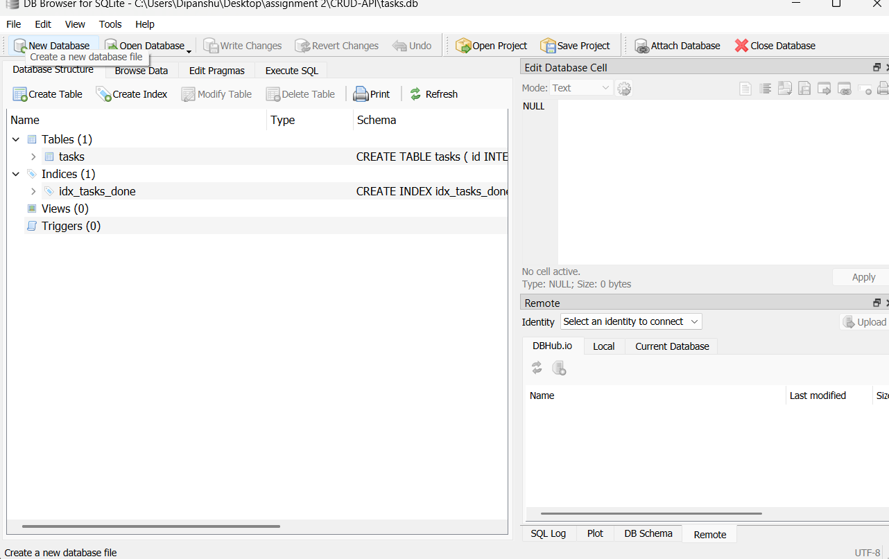
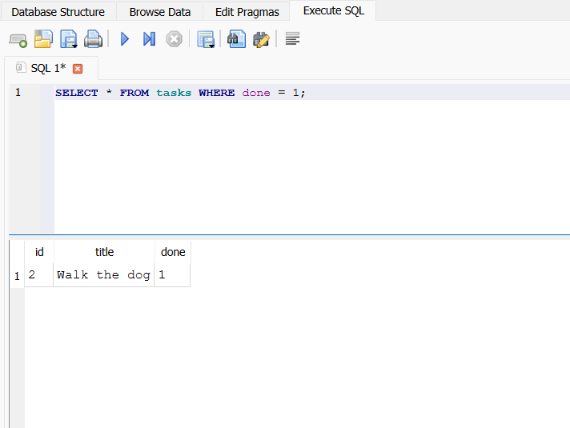
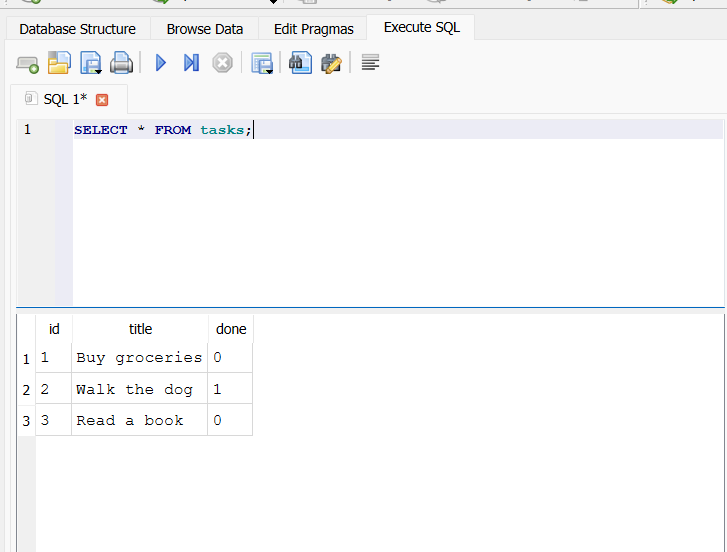
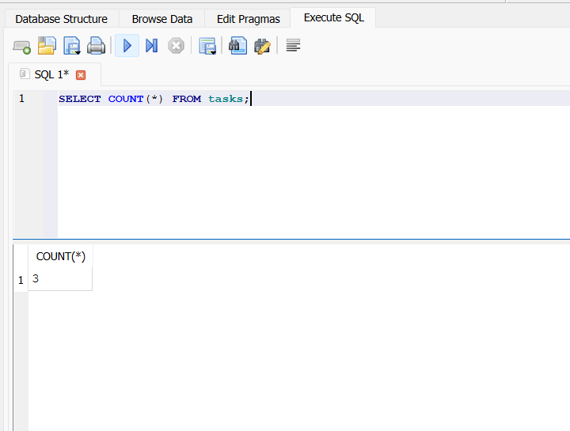
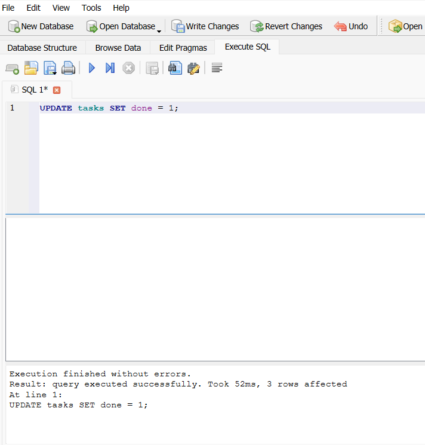
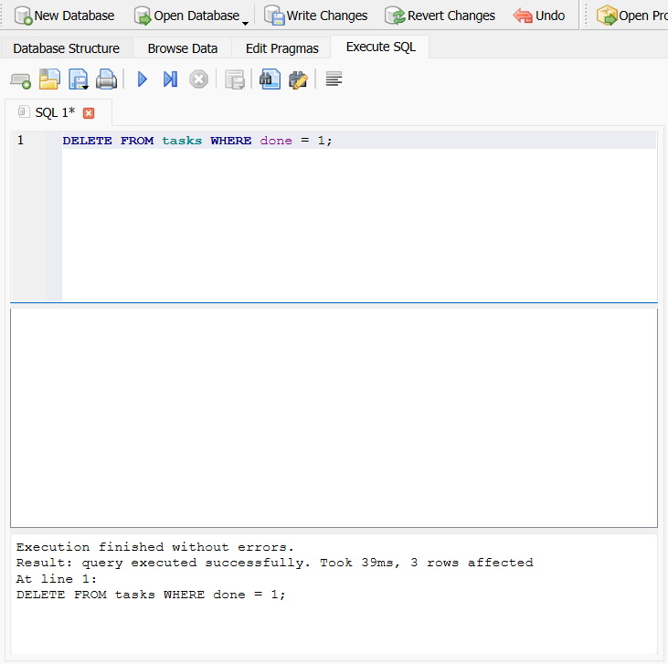

# Task API — FlyRank Internship Week 3 Assignment A2

A small **Node.js + Express CRUD API** for managing a to-do list. In Week 2 tasks lived in an in-memory array; in Week 3 (this version) they are stored in a **SQLite database** (`tasks.db`), so data survives restarts. The endpoints and responses are identical to Week 2.

## Tech stack

- Node.js
- Express
- Swagger UI (`swagger-ui-express`)
- OpenAPI 3.0.3
- SQLite via `better-sqlite3` (synchronous, parameterized queries)

## Getting started

### 1. Install dependencies

```bash
npm install
```

### 2. Start the API

```bash
npm start
```

For development with automatic restart:

```bash
npm run dev
```

The API runs at:

```text
http://localhost:3000
```

Swagger UI:

```text
http://localhost:3000/docs
```

## Why SQLite?

- **Single file** — the whole database is `tasks.db`.
- **Zero setup** — no server to install; the file and the `tasks` table are created automatically on first run.
- **Survives restarts** — data is on disk, not in memory.

The database file lives next to `index.js` and is git-ignored, so every fresh clone starts clean with the 3 seed tasks.

**Run command** (works on a clean clone):

```bash
npm install && npm start
```

## Database schema

```sql
CREATE TABLE IF NOT EXISTS tasks (
  id    INTEGER PRIMARY KEY,
  title TEXT NOT NULL,
  done  INTEGER NOT NULL DEFAULT 0   -- 0 = false, 1 = true
);
CREATE INDEX IF NOT EXISTS idx_tasks_done ON tasks(done);
```

All queries use `?` placeholders (parameterized), e.g. `SELECT * FROM tasks WHERE id = ?`, `INSERT INTO tasks (title, done) VALUES (?, ?)`, `UPDATE tasks SET title = ?, done = ? WHERE id = ?`, `DELETE FROM tasks WHERE id = ?`.

## Seed data

On first run (table empty) the server seeds three tasks, inside a transaction:

```json
[
  { "id": 1, "title": "Buy groceries", "done": false },
  { "id": 2, "title": "Walk the dog", "done": true },
  { "id": 3, "title": "Read a book", "done": false }
]
```

The seed runs only when the table is empty (`SELECT COUNT(*)` is 0), so restarting never duplicates the examples. Wrapping the three inserts in a **transaction** makes seeding all-or-nothing — a crash halfway can't leave a half-seeded table.

## API endpoints

| Method | Endpoint | Purpose | Success | Errors |
|---|---|---|---|---|
| GET | `/` | API information | 200 | — |
| GET | `/health` | Health check | 200 | — |
| GET | `/tasks` | List all tasks | 200 | 400 |
| GET | `/tasks/:id` | Get one task | 200 | 404 |
| POST | `/tasks` | Create a task | 201 | 400 |
| PUT | `/tasks/:id` | Update a task | 200 | 400, 404 |
| DELETE | `/tasks/:id` | Delete a task | 204 | 404 |
| GET | `/stats` | Task statistics (extra) | 200 | — |
| POST | `/reset` | Restore seed data (extra) | 200 | — |
| GET | `/docs` | Swagger UI | 200 | — |

## CRUD examples

### Read all tasks

```bash
curl -i http://localhost:3000/tasks
```

### Read one task

```bash
curl -i http://localhost:3000/tasks/1
```

Unknown IDs return `404`:

```bash
curl -i http://localhost:3000/tasks/99
```

Response body:

```json
{"error":"Task 99 not found"}
```

### Create a task

```bash
curl -i -X POST http://localhost:3000/tasks \
  -H "Content-Type: application/json" \
  -d '{"title":"Buy milk"}'
```

The server assigns the next available ID, sets `done` to `false`, and returns `201 Created`.

Invalid input such as `{}` returns `400 Bad Request`.

### Update a task

Update the completion state:

```bash
curl -i -X PUT http://localhost:3000/tasks/1 \
  -H "Content-Type: application/json" \
  -d '{"done":true}'
```

Update both fields:

```bash
curl -i -X PUT http://localhost:3000/tasks/1 \
  -H "Content-Type: application/json" \
  -d '{"title":"Buy oat milk","done":true}'
```

### Delete a task

```bash
curl -i -X DELETE http://localhost:3000/tasks/1
```

A successful delete returns `204 No Content` with an empty body.

## Sample `curl -i` output

```text
$ curl -i http://localhost:3000/tasks/1
HTTP/1.1 200 OK
X-Powered-By: Express
Content-Type: application/json; charset=utf-8
Content-Length: 45
ETag: W/"2d-Gv8HDdZD1sn+UqMseo56OTgQmek"
Date: Tue, 06 Oct 2026 16:07:41 GMT
Connection: keep-alive
Keep-Alive: timeout=5

{"id":1,"title":"Buy groceries","done":false}
```

## Optional extras

Optional extras, now done in SQL (`WHERE done = ?`, `WHERE title LIKE ?`, `SELECT COUNT(*)`):

### Filter by completion

```bash
curl -i "http://localhost:3000/tasks?done=true"
```

### Search by title

```bash
curl -i "http://localhost:3000/tasks?search=milk"
```

Search is case-insensitive. The filters can also be combined:

```bash
curl -i "http://localhost:3000/tasks?done=false&search=book"
```

### Statistics

```bash
curl -i http://localhost:3000/stats
```

Example:

```json
{"total":3,"done":1,"open":2}
```

### Reset seed data

```bash
curl -i -X POST http://localhost:3000/reset
```

## Persistence proof

I created tasks, stopped the server, started it again, and `GET /tasks` still returned them — the first time the data survived a restart. I also opened `tasks.db` in DB Browser for SQLite and saw the same rows the API returns.



## Stage 4 — SQL by hand

I opened `tasks.db` in DB Browser for SQLite and ran these queries by hand in the *Execute SQL* tab.

**1. List completed tasks** — returned one row, `Walk the dog` (`done = 1`):

```sql
SELECT * FROM tasks WHERE done = 1;
```



**2. List every task** — returned all 3 seed tasks:

```sql
SELECT * FROM tasks;
```



**3. Count tasks** — returned `3`:

```sql
SELECT COUNT(*) FROM tasks;
```



**4. Mark every task completed** — `3 rows affected`:

```sql
UPDATE tasks SET done = 1;
```



After this (and **Write Changes**), `GET /tasks` showed every task with `"done": true` without restarting the server. The API and DB Browser read the same file, so there is one source of truth and no syncing.

**5. Delete completed tasks** — `3 rows affected` (all tasks were completed after query 4, so the table became empty; `POST /reset` restores the seed data):

```sql
DELETE FROM tasks WHERE done = 1;
```



## Why identical tests passing proves storage is an implementation detail

The same curl commands from Week 2 (below) pass unchanged against the SQLite version: same status codes, same JSON. Clients only depend on the API contract, not on where data is kept, so swapping memory for SQLite changed nothing they can observe.

## What is an index?

`idx_tasks_done` is an index on `done`; it lets SQLite find rows matching `WHERE done = ?` without scanning the whole table (like a book's index).

## Swagger UI

Open:

```text
http://localhost:3000/docs
```

Swagger UI documents the API from `openapi.json` and provides a **Try it out** button for testing the endpoints without curl.

### Swagger screenshot


`POST /tasks` tested with **Try it out** (response `201 Created`):


## Curl checkpoint

The main Stage 4 CRUD checkpoint is:

```bash
# Create
curl -i -X POST http://localhost:3000/tasks \
  -H "Content-Type: application/json" \
  -d '{"title":"Finish assignment"}'

# Read
curl -i http://localhost:3000/tasks

# Update
curl -i -X PUT http://localhost:3000/tasks/4 \
  -H "Content-Type: application/json" \
  -d '{"done":true}'

# Delete
curl -i -X DELETE http://localhost:3000/tasks/4
```

Expected successful status codes are `201` for create, `200` for reads/update, and `204` for delete. Unknown task IDs return `404`; invalid request bodies return `400`.

## Project structure

```text
.
├── index.js          # Express server, SQLite storage, CRUD routes
├── openapi.json      # OpenAPI specification used by Swagger UI
├── tasks.db          # SQLite database (auto-created, git-ignored)
├── docs/             # Screenshots (Swagger UI, DB Browser)
├── package.json      # Project metadata and npm scripts
├── package-lock.json # Locked dependency versions
├── .gitignore
└── README.md
```

## Assignment completion checklist

- [x] Stage 0 — `tasks.db` + `tasks` table created automatically, seeded once
- [x] Stage 1 — `GET /tasks` and `GET /tasks/:id` read from SQLite
- [x] Stage 2 — `POST /tasks` uses `INSERT`
- [x] Stage 3 — `PUT` / `DELETE` use `UPDATE` / `DELETE`
- [x] Stage 4 — explored SQL in DB Browser
- [x] Stage 5 — README, screenshot, public repo
- [x] Extras: SQL search/filter/stats, index, transaction
